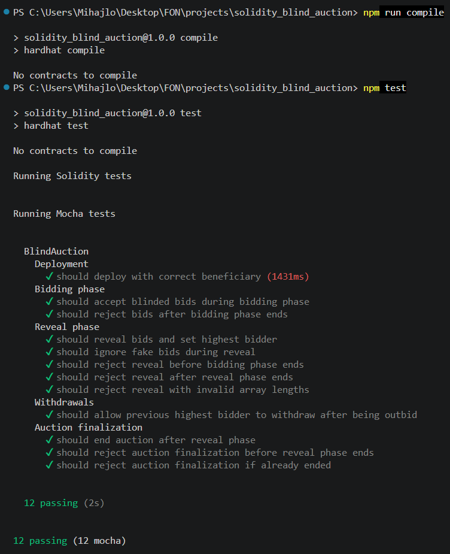

# Smart Contract Development – Solidity Blind Auction

Blind Auction smart contract written in Solidity, implementing the commit-reveal bidding pattern.

This project was developed as part of the "Concurrent and Distributed Programming" course at the Faculty of Organizational Sciences.

## Project Overview

The goal of this project is to implement a Blind Auction using Solidity. The project is based on the official Solidity documentation example and demonstrates how the commit-reveal pattern can be used to keep bids hidden during the bidding phase.

Instead of submitting the actual bid value directly, each participant submits a hashed version of their bid. Later, during the reveal phase, participants reveal the original bid data. The smart contract verifies whether the revealed data matches the previously submitted hash.

## How does a Blind Auction work?

The auction consists of a three-phase lifecycle:

### 1. Bidding Phase 

During the bidding phase, users submit a blinded bid. A blinded bid is a hash created from:

`value + fake + secret`

The contract stores only the hash and the attached deposit. The actual bid value remains hidden.

### 2. Reveal Phase 

After the bidding phase ends, users reveal their original bid data:

`value`
`fake`
`secret`

The smart contract recalculates the hash and checks whether it matches the previously submitted blinded bid.

What makes a bid valid is only if given arguments match:

`fake == false` and
`deposit >= value`

If the bid is valid and higher than the current highest bid, it becomes the new highest bid.

### 3. Auction Finalization

After the reveal phase ends, the auction can be concluded and finalized. The highest bid is transferred to the beneficiary, and the contract emits an `AuctionEnded` event.

## Smart Contract Structure

The main contract is located in: 

`contracts/BlindAuction.sol`

The contract itself includes:
 * `bid()` - submits a blinded bid during the bidding phase
 * `reveal()` - reveals bid values during the reveal phase
 * `withdraw()` - allows users to withdraw refundable balances
 * `auctionEnd()` - finalizes the auction and transfers funds to the beneficiary
 * `placeBid()` - internal helper function for updating the highest bid

## Testing 

The test suite is located in:

`test/BlindAuction.ts`

The tests covered are:
 * contract deployment
 * accepting blinded bids
 * rejecting bids after the bidding phase
 * revealing valid bids
 * ignoring fake bids
 * rejecting early reveal attempts
 * rejecting late reveal attempts
 * rejecting invalid reveal input
 * withdrawing refundable balances
 * finalizing the auction
 * rejecting early finalization
 * rejecting repeated finalization

## Testing result

## Commit-Reveal example

A bidder creates a blinded bid using the `keccak256` hashing function with given input:

`value = 10`

`fake = false`  

`secret = "alice"`

The hash is submitted during the bidding phase. Later, the user reveals `value`, `fake` and `secret`, while the smart contract verifies the bid.

## FAQ 

### How do other participants know the current highest bid value?

They do not know it during the bidding phase. That is the main purpose of a blind auction.

During the bidding phase, participants only submit hashed bids, so the actual bid values remain hidden. The highest bid becomes known only after the reveal phase, when participants reveal their original bid data and the contract validates it.

### What are `value`, `fake` and `secret`?

`value` represents the actual bid amount the user wants to submit.

`fake` is a boolean value used to mark whether a bid is fake. Fake bids can be used to hide the bidder's real intention. A fake bid is revealed correctly but it is not considered a valid bid for winning the auction.

`secret` is a private value chosen by the bidder. It is used together with `value` and `fake` to create the blinded bid hash. Without the correct secret, the bid cannot be successfully revealed.

### What exactly is a beneficiary?

The beneficiary is the address that receives the highest bid amount when the auction is finalized. 

In this project, the beneficiary is passed to the smart contract through the constructor when the contract is deployed.

### Why is the deposit sent during the bidding phase?

The deposit ensures that the bidder has locked enough Ether to support their bid. During the reveal phase, a bid is valid only if the deposit is greater than or equal to the revealed bid value.

If the bid is not winning, the refundable amount can later be withdrawn.

### Why is there a `withdraw()` function?

The contract uses a pull-payment pattern. Instead of automatically sending Ether back to users in every case, refundable balances are stored in `pendingReturns`.

Users can then call `withdraw()` to retrieve their refundable amount. This is a safer design pattern for handling Ether transfers in smart contracts.

## Quick setup

Install dependencies:

`npm install`

Compile the smart contract using Hardhat:

`npx hardhat compile`

Run the complete testing part:

`npx hardhat test`

Previously mentioned commands have a shortcut written in package.json:

`npm run compile` and
`npm test`

## Technologies used
 * Solidity
 * Hardhat
 * TypeScript
 * Mocha (organizes and runs the test suite)
 * Chai (checks whether the smart contract behaves as expected)
 * Ethers (interaction with the Ethereum environment/smart contract)

 ## Reference

This project is based on the official Solidity Blind Auction example from `Solidity by Example`.

[Solidity by Example – Blind Auction](https://docs.soliditylang.org/en/v0.8.35/solidity-by-example.html#blind-auction)
